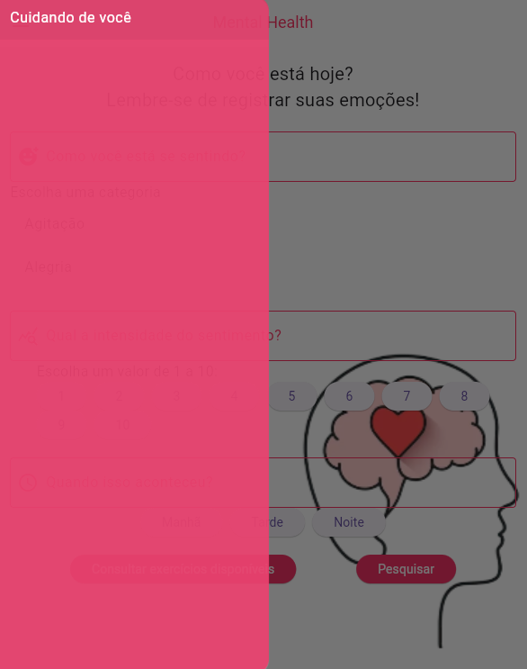
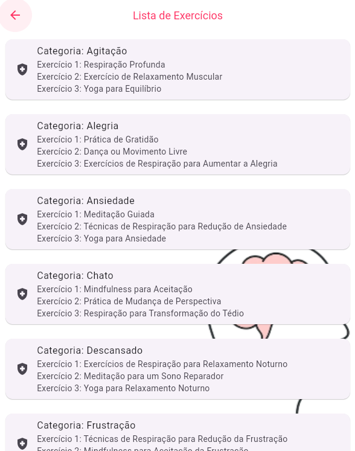
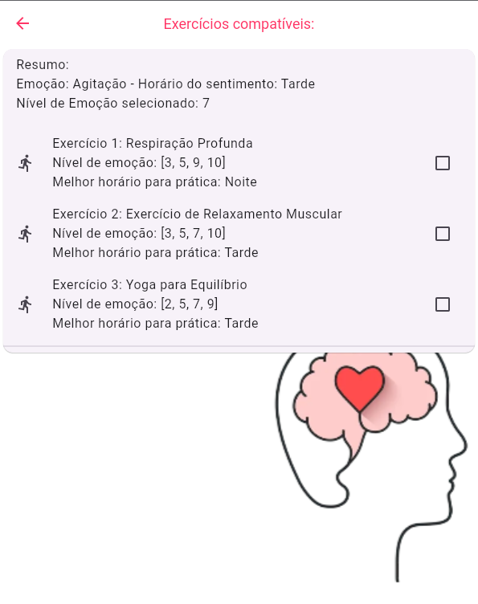
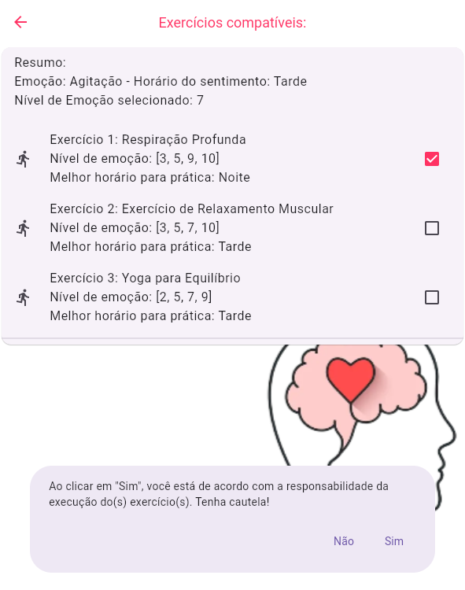

# Mental Health

Pensando em uma forma de tornar a assistência médica mais acessível, rápida e precisa, este é um aplicativo para bem-estar mental que oferece exercícios e técnicas de relaxamento para os usuários, a um toque do seu celular.

## Instalação

### Requisitos

- Flutter SDK
- Emulador Android/iOS ou dispositivo físico

### Método: Instalação via Android Studio ou Visual Studio Code

1. #### Clone o Repositório:

   Abra o seu ambiente de desenvolvimento (Android Studio ou Visual Studio Code) e clone este repositório para o seu computador.

1. #### Instalar Dependências:

   No terminal, digite o seguinte código para instalar as dependências:

   ```bash
   flutter pub get
   ```

1. #### Executar o Aplicativo:

   Inicie o projeto:

   ```bash
   flutter run
   ```
   Escolha como deseja executar o projeto.
   
   **RECOMENDAÇÃO: Utilize o Chrome**

1. #### Conceder Permissões:

   Dependendo das permissões necessárias pelo aplicativo, você pode ser solicitado a conceder permissões adicionais durante a instalação ou quando executar o aplicativo pela primeira vez. Certifique-se de conceder as permissões necessárias para o funcionamento adequado do aplicativo.

# Informações importantes:

### MOCK DE DADOS PARA LOGIN:

- **Usuário**: user
- **Senha**:   user

## Arquitetura de Microsserviços

### Decomposição de Funcionalidades

- **Serviço de Autenticação:** Responsável pela autenticação de usuários.
- **Serviço de Exercícios:** Gerencia os dados dos exercícios disponíveis.
- **Serviço de Recomendação de Exercícios:** Fornece exercícios filtrados com base na seleção do usuário.
- **Serviço de Notificação:** Envio de notificações e lembretes para os usuários.

### Comunicação entre Serviços

- Utilização de APIs RESTful ou mensageria assíncrona para comunicação entre os serviços.
- Opção por uma arquitetura de eventos para atualizações em tempo real.

### Escalabilidade e Tolerância a Falhas

- Implementação de balanceamento de carga para lidar com o aumento do tráfego.
- Uso de estratégias de failover para garantir a disponibilidade contínua dos serviços.

### Segurança e Autenticação

- Autenticação baseada em tokens para acessar os serviços.
- Criptografia e práticas de segurança padrão para proteger os dados sensíveis.

## Funcionalidades do Aplicativo

### Seleção de Emoções e Níveis de Emoção

- Interface intuitiva para que o usuário escolha entre emoções pré-definidas e níveis de intensidade.
- Utilização de botões para seleção e navegação.

### Menu Sidebar

- Componente utilizado para navegação entre a página de home e lista de exercícios.

### Visualização de Exercícios

- Exibição dos exercícios compatíveis com base nas seleções do usuário.
- Layout que apresente informações sobre cada exercício (nome, descrição, técnicas, etc.).

### Escolha de Exercícios

- Permitir ao usuário selecionar um exercício específico para visualizar detalhes.
- Interface para iniciar o exercício escolhido.

### Gerenciamento de Estado

- Utilização de gerenciamento de estado robusto para manter a consistência dos dados exibidos na interface.
- Controle preciso dos eventos e atualizações para refletir as mudanças de estado.

## Gerenciamento de Memória

### Uso Eficiente de Recursos

- Otimização de código para minimizar o uso de recursos durante a execução de operações.
- Liberação de memória após o uso de variáveis temporárias ou recursos alocados.

### Descarte de Objetos Não Utilizados

- Implementação de técnicas para liberar objetos da memória quando não estiverem mais em uso.
- Gerenciamento cuidadoso de recursos para evitar vazamentos de memória.

### Uso Consciente de Recursos Pesados

- Carregamento assíncrono de recursos pesados, como imagens, para evitar sobrecarga na memória.
- Cache de recursos frequentemente usados para reduzir a carga sobre a memória.

### Utilização de Ferramentas de Análise

- Utilização de ferramentas de profiling para identificar gargalos de desempenho e vazamentos de memória.
- Monitoramento constante do consumo de memória durante o desenvolvimento e teste do aplicativo.

## Imagens

### Inicial


### Login


### Home





### Lista de Exercícios



### Exercícios compatíveis




### Finalização


### Contribuição

Contribuições são bem-vindas! Se você deseja contribuir para este projeto, siga estas etapas:

    1. Faça um fork deste repositório.
    2. Crie uma nova branch com uma descrição clara da sua contribuição.
    3. Faça as alterações necessárias.
    4. Envie um pull request para a branch principal deste repositório.
